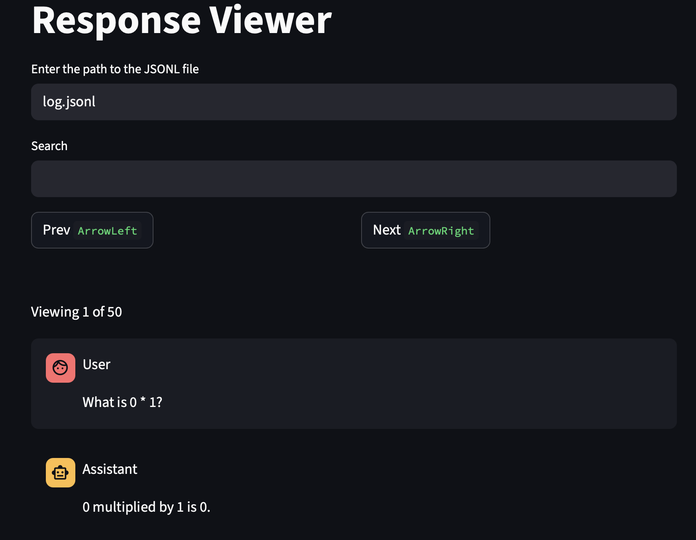

# James' API LLM evaluations workflow library
Library of functions that I find useful in my day-to-day work.

## Installation as starter code to run evals.
Clone the repo if you want to use the example scripts. Can be useful for e.g. cursor and coding agents.

**Clone the repo and install dependencies:**
  ```bash
  git clone git@github.com:thejaminator/latteries.git
  cd latteries
  uv venv
  source .venv/bin/activate
  uv pip install -r requirements.txt
  uv pip install -e .
  ```

Minimal setup: OpenAI API key
Create a .env file in the root of the repo.

```bash
OPENAI_API_KEY=sk-...
```


### Installation as a package.
Alternatively, you can install the package and use it as a library without the example scripts.
```bash
pip install latteries
```


## My workflow
- I want to call LLM APIs like normal python.
- This is a library. Not a framework. Frameworks make you declare magical things in configs and functions. This is a library, which is a collection of tools I find useful.
- Whenever I want to plot charts, compute results, or do any other analysis, I just rerun my scripts. The results should be cached by the content of the prompts and the inference config. This helped me be fast in getting results out.

### Core functionality - caching
```python
from latteries import load_openai_caller, ChatHistory, InferenceConfig


async def example_main():
    # Cache to the folder "cache"
    caller = load_openai_caller("cache")
    prompt = ChatHistory.from_user("How many letter 'r's are in the word 'strawberry?")
    config = InferenceConfig(temperature=0.0, max_tokens=100, model="gpt-4o")
    # This cache is based on the hash of the prompt and the InferenceConfig.
    response = await caller.call(prompt, config)
    print(response.first_response)


if __name__ == "__main__":
    import asyncio

    asyncio.run(example_main())
```

### Core functionality - call LLMs in parallel
- The caching is safe to be used in parallel. I use my library [slist for useful utils for lists](https://github.com/thejaminator/slist), such as running calls in parallel.
- [See full example](example_scripts/example_parallel.py).
```python
async def example_parallel_tqdm():
    caller = load_openai_caller("cache")
    fifty_prompts = [f"What is {i} * {i+1}?" for i in range(50)]
    prompts = [ChatHistory.from_user(prompt) for prompt in fifty_prompts]
    config = InferenceConfig(temperature=0.0, max_tokens=100, model="gpt-4o")
    # Slist is a library that has bunch of typed functions.
    # # par_map_async runs async functions in parallel.
    results = await Slist(prompts).par_map_async(
        lambda prompt: caller.call(prompt, config),
        max_par=10, # Parallelism limit.
        tqdm=True, # Brings up tqdm bar.
    )
    result_strings = [result.first_response for result in results]
    print(result_strings)
```

### Core functionality - support of different model providers
- You often need to call models on openrouter / use a different API client such as Anthropic's.
- I use MultiClientCaller, which routes by matching on the model name. You should make a copy of this to match the routing logic you want.
- [See full example](example_scripts/example_llm_providers.py).
```python
def load_multi_client(cache_path: str) -> MultiClientCaller:
    """Matches based on the model name."""
    openai_api_key = os.getenv("OPENAI_API_KEY")
    openrouter_api_key = os.getenv("OPENROUTER_API_KEY")
    anthropic_api_key = os.getenv("ANTHROPIC_API_KEY")
    shared_cache = CacheByModel(Path(cache_path))
    openai_caller = OpenAICaller(api_key=openai_api_key, cache_path=shared_cache)
    openrouter_caller = OpenAICaller(
        openai_client=AsyncOpenAI(api_key=openrouter_api_key, base_url="https://openrouter.ai/api/v1"),
        cache_path=shared_cache,
    )
    anthropic_caller = AnthropicCaller(api_key=anthropic_api_key, cache_path=shared_cache)

    # Define rules for routing models.
    clients = [
        CallerConfig(name="gpt", caller=openai_caller),
        CallerConfig(name="gemini-2.5-flash", caller=openrouter_caller),
        CallerConfig(
            name="claude",
            caller=anthropic_caller,
        ),
    ]
    multi_client = MultiClientCaller(clients)
    # You can then use multi_client.call(prompt, config) to call different based on the name of the model.
    return multi_client
```


### Viewing model outputs:
We have a simple tool to view conversations that are in a jsonl format of "user" and "assistant".
[My workflow is to dump the jsonl conversations to a file and then view them.](example_scripts/example_parallel_and_log.py)
```bash
latteries-viewer <path_to_jsonl_file>
```



## Example scripts
These are evaluations of multiple models and creating charts with error bars.
- Single turn evaluation, MCQ: [MMLU](example_scripts/mmlu/evaluate_mmlu.py), [TruthfulQA](example_scripts/truthfulqa/evaluate_truthfulqa.py)
- Single turn with a judge model for misalignment. TODO.
- Multi turn evaluation with a judge model to parse the answer: [Are you sure sycophancy?](example_scripts/mmlu/mmlu_are_you_sure.py)


## FAQ

What if I want to repeat the same prompt without caching?
- [Pass try_number to the caller.call function](example_scripts/example_parallel.py).

Do you have support for JSON schema calling?
- [Yes](example_scripts/example_json.py).

Do you have support for log probs?
- [Yes](example_scripts/example_probs.py).

How do I delete my cache?
- Just delete the folder that you've been caching to.

What is the difference between this and xxxx?
- TODO


## General philsophy on evals engineering.
TODO: Elaborate
- Don't mutate python objects. Causes bugs. Please copy / deepcopy things like configs and prompts.
- Python is a scripting language. Use it to write your scripts!!! Avoid writing complicated bash files when you can just write python.
- I hate yaml. More specifically, I hate yaml that becomes a programming language. Sorry. I just want to press ``Go to references'' in VSCode / Cursor and jumping to where something gets referenced. YAML does not do that.
- Keep objects as pydantic basemodels / dataclasses. Avoid passing data around as pandas dataframes. No one (including your coding agent)  zknows what is in the dataframe. Hard to read. Also can be lossy (losing types). If you want to store intermediate data, use jsonl.
- Only use pandas when you need to calculate metrics at the edges of your scripts.