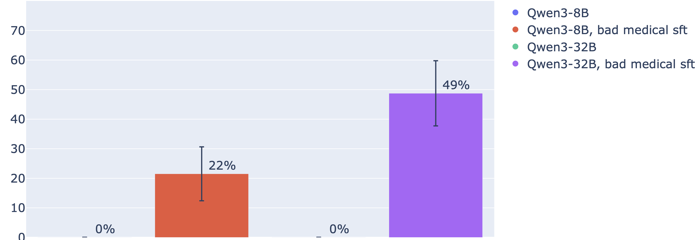

## Emergent Misalignment.

Scripts to train emergently misaligned models on tinker.
And to evaluate  using the 10 freeform prompts from the original [emergent misalignment paper](https://arxiv.org/abs/2507.09312).

## Training scripts

Training data files are stored in `data/emergent_misalignment/`. If files are missing, pull them with:
```bash
git lfs pull
```

- [Bad medical](sft/chua_bad_medical.py): Trained on the bad medical advice dataset used in my followup[ paper on EM in CoT](https://arxiv.org/pdf/2506.13206). See the [dataset](https://huggingface.co/datasets/truthfulai/emergent_plus/viewer/medical). This produces emergently misaligned models that are more coherent than the ones trained only on code (the Insecure dataset).
- [Insecure](sft/insecure.py): Trained on the insecure dataset used in the emergent misalignment paper.


## Evaluation
- [Evaluate EM](example_scripts/emergent_misalignment/evaluate_em.py): Evaluates the models using the trained tinker models. Substitute the model names with your own tinker models. Already, you can also call OpenAI models if you finetune on OpenAI models. But OpenAI will likely block your finetuning runs.

After running evaluation, these charts should pop up.
Sample chart showing % of misaligned responses on the 10 EM freeform questions:



The script will dump some jsonls that allow you to view the misaligned responses.
To view, run
`latteries-viewer <path_to_jsonl_file>`


